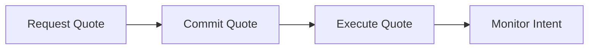

## Welcome to the Trails API

The Trails API enables seamless cross-chain token swaps, deposits, payments, and smart contract executions. This guide walks you through the complete flow from requesting a quote to executing a transaction.

## Core Workflow

Every interaction through Trails follows this four-step process:



### Step 1: Get a Quote

Request a quote to see rates, fees, and routing options for your transaction.

```typescript
const quoteResponse = await fetch('https://trails-api.sequence.app/rpc/Trails/QuoteIntent', {
  method: 'POST',
  headers: {
    'Content-Type': 'application/json',
  },
  body: JSON.stringify({
    ownerAddress: '0x742d35Cc6634C0532925a3b844Bc9e7595f0bEb', // sender address
    originChainId: 1, // Ethereum
    originTokenAddress: '0xA0b86991c6218b36c1d19D4a2e9Eb0cE3606eB48', // USDC
    originTokenAmount: 100000000, // 100 USDC (6 decimals)
    destinationChainId: 8453, // Base
    destinationTokenAddress: '0x833589fCD6eDb6E08f4c7C32D4f71b54bdA02913', // USDC on Base
    destinationToAddress: '0x742d35Cc6634C0532925a3b844Bc9e7595f0bEb',
    tradeType: 'EXACT_INPUT',
    options: {
      slippageTolerance: 0.5, // 0.5%
      quoteProvider: 'RELAY'
    }
  })
});

const { intent, gasFeeOptions } = await quoteResponse.json();

console.log('Quote received:', {
  fromAmount: intent.quote.fromAmount,
  toAmount: intent.quote.toAmount,
  totalFees: intent.fees.totalFeeUsd,
  expiresAt: intent.expiresAt
});
```

**Key Parameters:**

- **ownerAddress**: User's sender address
- **originChainId** & **destinationChainId**: Source and destination chains
- **originTokenAddress** & **destinationTokenAddress**: Token contracts
- **originTokenAmount**: Amount to swap (in token's smallest unit)
- **tradeType**: `EXACT_INPUT` (specify input) or `EXACT_OUTPUT` (specify output)

<Tip>
Use `EXACT_INPUT` when you know how much you want to spend, and `EXACT_OUTPUT` when you know exactly how much you need to receive.
</Tip>

### Step 2: Commit the Intent

Lock in the quote by committing the intent from the previous response which will reserve the rates.

```typescript
const commitResponse = await fetch('https://trails-api.sequence.app/rpc/Trails/CommitIntent', {
  method: 'POST',
  headers: {
    'Content-Type': 'application/json',
  },
  body: JSON.stringify({ intent })
});

const { intentId } = await commitResponse.json();

console.log('Intent committed:', intentId);
```

<Warning>
Committed intents expire after a set period (check `intent.expiresAt`). Execute before expiration or request a new quote.
</Warning>

### Step 3: Execute the Transaction

Now we can execute the intent. First, send tokens to the intent address then call the execution:

```typescript
// First, send tokens to the intent address
const depositTx = await walletClient.sendTransaction({
  to: intent.depositTransaction.toAddress,
  value: 0n,
  data: encodeERC20Transfer( // Use your favorite library such as viem to encode if ERC20 transfer
    intent.depositTransaction.tokenAddress,
    intent.depositTransaction.toAddress,
    intent.depositTransaction.amount
  )
});

// Wait for transaction confirmation using viem
const receipt = await publicClient.waitForTransactionReceipt({
  hash: depositTx
});

// Then execute the intent with the deposit transaction hash and intentId
const executeResponse = await fetch('https://trails-api.sequence.app/rpc/Trails/ExecuteIntent', {
  method: 'POST',
  headers: {
    'Content-Type': 'application/json',
  },
  body: JSON.stringify({
    intentId,
    depositTransactionHash: depositTx
  })
});

const { intentStatus } = await executeResponse.json();
console.log('Execution started:', intentStatus);
```

### Step 4: Monitor Completion

Wait for the transaction to complete using the streaming endpoint:

```typescript
async function waitForCompletion(intentId: string) {
  while (true) {
    const waitResponse = await fetch(
      'https://trails-api.sequence.app/rpc/Trails/WaitIntentReceipt',
      {
        method: 'POST',
        headers: {
          'Content-Type': 'application/json',
        },
        body: JSON.stringify({ intentId })
      }
    );

    const { intentReceipt, done } = await waitResponse.json();

    console.log('Status:', intentReceipt.status);

    // If done is true, the intent has reached a terminal state
    if (done) {
      if (intentReceipt.status === 'SUCCEEDED') {
        console.log('✅ Transaction completed!');
        console.log('Deposit TX:', intentReceipt.depositTransaction.txnHash);
        console.log('Origin TX:', intentReceipt.originTransaction.txnHash);
        console.log('Destination TX:', intentReceipt.destinationTransaction.txnHash);
        return intentReceipt;
      } else {
        throw new Error('Transaction failed: ' + intentReceipt.originTransaction.statusReason);
      }
    }
    
    // If not done, the endpoint will have waited internally before returning until completion
  }
}

const receipt = await waitForCompletion(intentId);
```

## Support

Need help? Join our community:

- **Telegram**: [https://t.me/build_with_trails](https://t.me/build_with_trails)
- **Documentation**: Browse the endpoint references for detailed information and advanced use cases
- **Demo**: Try the [interactive playground](https://demo.trails.build/widget)
