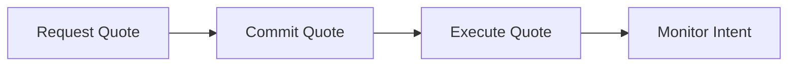

## Welcome to the Trails API

The Trails API enables seamless cross-chain token swaps, deposits, payments, and smart contract executions in a simplified interface with the Trails protocol.

## Authentication

All API requests require an API key passed in the `X-Access-Key` header.

```typescript
const response = await fetch('https://trails-api.sequence.app/rpc/Trails/QuoteIntent', {
  method: 'POST',
  headers: {
    'Content-Type': 'application/json',
    'X-Access-Key': 'YOUR_ACCESS_KEY'
  },
  body: JSON.stringify({ /* request body */ })
});
```

<Note>
**Get Your API Key**: Join the [Trails Telegram group](https://t.me/build_with_trails) to request your API access key.
</Note>

### API Key Best Practices

| Practice | Description |
|----------|-------------|
| **Environment variables** | Store keys in `TRAILS_API_KEY` env var, never hardcode |
| **Server-side only** | Make API calls from your backend to keep keys secret |
| **Rotate regularly** | Request new keys periodically, especially if compromised |
| **Separate keys** | Use different keys for development and production |

```typescript
// ✅ Good: Load from environment
const apiKey = process.env.TRAILS_API_KEY;

// ❌ Bad: Hardcoded in source
const apiKey = 'abc123...';
```

## Base URL

All endpoints use the base URL:

```
https://trails-api.sequence.app/rpc/Trails/
```

## Core Workflow

Every interaction through Trails follows this flow:



<Steps>
  <Step>
    ### Get Wallet Balance
    Before requesting a quote, fetch the user's token balances using a multichain Indexer to display total available tokens and amounts for the user to select:

```typescript
const balancesResponse = await fetch('https://indexer.sequence.app/rpc/IndexerGateway/GetTokenBalances', {
  method: 'POST',
  headers: {
    'Content-Type': 'application/json',
    'X-Access-Key': 'YOUR_ACCESS_KEY'
  },
  body: JSON.stringify({
    accountAddress: '0x0709CF2d5D4f3D38f5948d697fE64d7FB3639Eb1',
    includeMetadata: true
  })
});

const { balances } = await balancesResponse.json();

// Display balances in your UI for user to select tokens, amount, and routes.
console.log('Available tokens:', balances);
```
  </Step>

  <Step>
    ### Get a Quote
    Request a quote to see rates, fees, and routing options for your transaction.

```typescript
const quoteResponse = await fetch('https://trails-api.sequence.app/rpc/Trails/QuoteIntent', {
  method: 'POST',
  headers: {
    'Content-Type': 'application/json',
    'X-Access-Key': 'YOUR_ACCESS_KEY'
  },
  body: JSON.stringify({
    ownerAddress: '0x0709CF2d5D4f3D38f5948d697fE64d7FB3639Eb1', // sender address
    originChainId: 42161, // Arbitrum One
    originTokenAddress: '0xaf88d065e77c8cC2239327C5EDb3A432268e5831', // USDC
    originTokenAmount: 100000000, // 100 USDC (6 decimals)
    destinationChainId: 8453, // Base
    destinationTokenAddress: '0x833589fCD6eDb6E08f4c7C32D4f71b54bdA02913', // USDC on Base
    destinationToAddress: '0x0709CF2d5D4f3D38f5948d697fE64d7FB3639Eb1', // recipient
    tradeType: 'EXACT_INPUT',
    options: {
      slippageTolerance: 0.005, // 0.5%
      bridgeProvider: 'RELAY'
    }
  })
});

const { intent, gasFeeOptions } = await quoteResponse.json();

console.log('Quote received:', {
  fromAmount: intent.quote.fromAmount,
  toAmount: intent.quote.toAmount,
  totalFees: intent.fees.totalFeeUsd,
  expiresAt: intent.expiresAt
});
```

**Key Parameters:**

- **ownerAddress**: User's wallet address
- **originChainId** & **destinationChainId**: Source and destination chains
- **originTokenAddress** & **destinationTokenAddress**: Token contracts
- **originTokenAmount**: Amount to swap (in token's smallest unit)
- **tradeType**: `EXACT_INPUT` (specify input) or `EXACT_OUTPUT` (specify output)

<Tip>
Use `EXACT_INPUT` when you know how much you want to spend, and `EXACT_OUTPUT` when you know exactly how much you need to receive.
</Tip>
  </Step>

  <Step>
    ### Commit the Intent
    Lock in the quote by committing the intent with the fetched contract addresses. This reserves the rates.

```typescript
const commitResponse = await fetch('https://trails-api.sequence.app/rpc/Trails/CommitIntent', {
  method: 'POST',
  headers: {
    'Content-Type': 'application/json',
    'X-Access-Key': 'YOUR_ACCESS_KEY'
  },
  body: JSON.stringify({ intent })
});

const { intentId } = await commitResponse.json();

console.log('Intent committed:', intentId);
```

You cannot change the contents of the intent, or the server will reject the commit. The `intent` object contains everything needed to relay and execute the intent.

<Warning>
Quotes expire **5 minutes** after being issued. Once committed, you have **10 minutes** to call `ExecuteIntent`. If either window expires, you'll need to request a new quote.
</Warning>
  </Step>

  <Step>
    ### Execute the Transaction
    Execute the intent using one of two mutually exclusive methods - either a normal transfer to the intent address or a permit operation if a user wants to pay in a non-native gas token:

<Tabs>
  <Tab title="Transfer Flow">
    Send tokens to the intent deposit address, then call `ExecuteIntent` with the transaction hash:

<Accordion title="Setup: Instantiate viem">
```typescript
import { createWalletClient, createPublicClient, http, encodeFunctionData, erc20Abi } from 'viem';
import { privateKeyToAccount } from 'viem/accounts';
import { base, arbitrum, mainnet } from 'viem/chains';

// Create clients (or use wagmi hooks: useWalletClient, usePublicClient)
const walletClient = createWalletClient({
  account: privateKeyToAccount('0x...'),
  chain: arbitrum, // Set to the origin chain
  transport: http()
});

const publicClient = createPublicClient({
  chain: arbitrum, // Set to the origin chain
  transport: http()
});
```
</Accordion>

```typescript
// Send tokens to the intent address (where Trails will execute from)
const intentAddress = intent.depositTransaction.toAddress;
const tokenAddress = intent.depositTransaction.tokenAddress;
const amount = intent.depositTransaction.amount;

const depositTxHash = await walletClient.sendTransaction({
  to: tokenAddress,
  data: encodeFunctionData( 
      {
          abi: erc20Abi,
          functionName: 'transfer',
          args: [intentAddress, amount]
      }
  )
});

// Wait for transaction confirmation using viem
const receipt = await publicClient.waitForTransactionReceipt({
  hash: depositTxHash
});

// Then execute the intent with the deposit transaction hash and intentId
const executeResponse = await fetch('https://trails-api.sequence.app/rpc/Trails/ExecuteIntent', {
  method: 'POST',
  headers: {
    'Content-Type': 'application/json',
    'X-Access-Key': 'YOUR_ACCESS_KEY'
  },
  body: JSON.stringify({
    intentId,
    depositTransactionHash: depositTxHash
  })
});

const { intentStatus } = await executeResponse.json();
console.log('Execution started:', intentStatus);
```
  </Tab>

  <Tab title="Alternative Fee Token Flow">
    Sign ERC712 permit signatures which enables paying with any non-native gas tokens that are permit compatible:

<Accordion title="Setup: Instantiate viem">
```typescript
import { createWalletClient, createPublicClient, http, encodeFunctionData, erc20Abi, parseAbi } from 'viem';
import { privateKeyToAccount } from 'viem/accounts';
import { base, arbitrum, mainnet } from 'viem/chains';

// Create clients (or use wagmi hooks: useWalletClient, usePublicClient)
const walletClient = createWalletClient({
  account: privateKeyToAccount('0x...'),
  chain: arbitrum, // Set to the origin chain
  transport: http()
});

const publicClient = createPublicClient({
  chain: arbitrum, // Set to the origin chain
  transport: http()
});
```
</Accordion>

```typescript
// Select a gas fee option from the quote response
const selectedGasFeeOption = gasFeeOptions.feeOptions[0]; // Choose based on user preference

// Constants for the flow
const INTENT_ENTRYPOINT_ADDRESS = '0x9470d883bac170116d397db3da71b2e57d567583'; // Trails Intent Entrypoint (same on all chains)
const deadline = Math.floor(Date.now() / 1000) + 3600; // 1 hour from now

// 1. Get user nonce from Intent Entrypoint contract
const userNonce = await publicClient.readContract({
  address: INTENT_ENTRYPOINT_ADDRESS,
  abi: parseAbi([
    'function nonces(address user) view returns (uint256)'
  ]),
  functionName: 'nonces',
  args: [intent.ownerAddress]
});

// 2. Check if approval is needed for the deposit token
const tokenAddress = intent.depositTransaction.tokenAddress;
const currentAllowance = await publicClient.readContract({
  address: tokenAddress,
  abi: erc20Abi,
  functionName: 'allowance',
  args: [intent.ownerAddress, INTENT_ENTRYPOINT_ADDRESS]
});

const needsApproval = currentAllowance < BigInt(intent.depositTransaction.amount);

// 3. If approval needed, get permit signature for the deposit token
let permitSignature;
let permitDeadline;
let permitAmount;

if (needsApproval) {
  // Read token metadata for permit signature
  const tokenNonce = await publicClient.readContract({
    address: tokenAddress,
    abi: parseAbi([
      'function nonces(address owner) view returns (uint256)'
    ]),
    functionName: 'nonces',
    args: [intent.ownerAddress]
  });

  const tokenName = await publicClient.readContract({
    address: tokenAddress,
    abi: parseAbi([
      'function name() view returns (string)'
    ]),
    functionName: 'name'
  });

  permitDeadline = deadline;
  permitAmount = '0xffffffffffffffffffffffffffffffffffffffffffffffffffffffffffffffff'; // maxUint256 for infinite approval

  permitSignature = await walletClient.signTypedData({
    domain: {
      name: tokenName,
      version: '1',
      chainId: intent.originChainId,
      verifyingContract: tokenAddress
    },
    types: {
      Permit: [
        { name: 'owner', type: 'address' },
        { name: 'spender', type: 'address' },
        { name: 'value', type: 'uint256' },
        { name: 'nonce', type: 'uint256' },
        { name: 'deadline', type: 'uint256' }
      ]
    },
    primaryType: 'Permit',
    message: {
      owner: intent.ownerAddress,
      spender: INTENT_ENTRYPOINT_ADDRESS,
      value: BigInt(permitAmount),
      nonce: tokenNonce,
      deadline: BigInt(permitDeadline)
    }
  });
}

// 4. Sign the intent signature (ERC712) with fee payment authorization
const intentAddress = intent.depositTransaction.toAddress;
const intentSignature = await walletClient.signTypedData({
  domain: {
    name: 'TrailsIntentEntrypoint',
    version: '1',
    chainId: intent.originChainId,
    verifyingContract: INTENT_ENTRYPOINT_ADDRESS
  },
  types: {
    TrailsIntent: [
      { name: 'user', type: 'address' },
      { name: 'token', type: 'address' },
      { name: 'amount', type: 'uint256' },
      { name: 'intentAddress', type: 'address' },
      { name: 'deadline', type: 'uint256' },
      { name: 'chainId', type: 'uint256' },
      { name: 'nonce', type: 'uint256' },
      { name: 'feeAmount', type: 'uint256' },
      { name: 'feeCollector', type: 'address' }
    ]
  },
  primaryType: 'TrailsIntent',
  message: {
    user: intent.ownerAddress,
    token: tokenAddress,
    amount: intent.depositTransaction.amount,
    intentAddress: intentAddress,
    deadline: BigInt(deadline),
    chainId: BigInt(intent.originChainId),
    nonce: userNonce,
    feeAmount: BigInt(selectedGasFeeOption.amount),
    feeCollector: selectedGasFeeOption.feeCollectorAddress
  }
});

// 5. Execute with signatures
const executeResponse = await fetch('https://trails-api.sequence.app/rpc/Trails/ExecuteIntent', {
  method: 'POST',
  headers: {
    'Content-Type': 'application/json',
    'X-Access-Key': 'YOUR_ACCESS_KEY'
  },
  body: JSON.stringify({
    intentId,
    depositSignature: {
      intentSignature,                      // ERC712 intent signature
      permitSignature,                      // ERC2612 permit signature (optional if already approved)
      permitDeadline,                       // Permit expiration timestamp (optional)
      permitAmount,                         // Permit amount - typically maxUint256 (optional)
      selectedGasFeeOption,                 // Fee option with: amount, tokenAddress, feeCollectorAddress
      userNonce: Number(userNonce),         // User's current nonce from Intent Entrypoint
      deadline                              // Intent expiration timestamp
    }
  })
});

const { intentStatus } = await executeResponse.json();
console.log('Execution started:', intentStatus);
```

<Note>
****
- Tokens must support ERC2612 permit (have `permit()` function)
- User nonce is read from the Intent Entrypoint contract, not the quote response
- Intent signature domain uses `TrailsIntentEntrypoint` name and the entrypoint contract as verifying contract

**Two Scenarios:**
1. **First time / No approval**: Include `permitSignature`, `permitDeadline`, `permitAmount`
2. **Already approved**: Omit permit fields entirely for a 1-click experience (like the example above - only `intentSignature`, `selectedGasFeeOption`, `userNonce`, `deadline`)
</Note>

**Example Request When Already Approved:**
```json
{
  "intentId": "0xc467d1ebb4c6aab9efd3485d2627e51fb8ce1f662808eccf1222f364a1aa2d01",
  "depositSignature": {
    "intentSignature": "0xe3e5a87b8c1a9f882f6b251ea551dc1703ce617a0308418...",
    "selectedGasFeeOption": {
      "tokenAddress": "0x833589fcd6edb6e08f4c7c32d4f71b54bda02913",
      "tokenSymbol": "USDC",
      "tokenDecimals": 6,
      "amount": "7845",
      "amountUsd": 0.007843596906252802,
      "feeCollectorAddress": "0x76008498f26789dd8b691bebe24c889a3dd1a2fc"
    },
    "userNonce": 1,
    "deadline": 1762424131
  }
}
```
  </Tab>
</Tabs>
  </Step>

  <Step>
    ### Monitor Completion
    Wait for the transaction to complete using the streaming endpoint:

```typescript
async function waitForCompletion(intentId: string) {
  while (true) {
    const waitResponse = await fetch(
      'https://trails-api.sequence.app/rpc/Trails/WaitIntentReceipt',
      {
        method: 'POST',
        headers: {
          'Content-Type': 'application/json',
          'X-Access-Key': 'YOUR_ACCESS_KEY'
        },
        body: JSON.stringify({ intentId })
      }
    );

    const { intentReceipt, done } = await waitResponse.json();

    console.log('Status:', intentReceipt.status);

    // If done is true, the intent has reached a terminal state
    if (done) {
      if (intentReceipt.status === 'SUCCEEDED') {
        console.log('✅ Transaction completed!');
        console.log('Deposit TX:', intentReceipt.depositTransaction.txnHash);
        console.log('Origin TX:', intentReceipt.originTransaction.txnHash);
        console.log('Destination TX:', intentReceipt.destinationTransaction.txnHash);
        return intentReceipt;
      } else {
        throw new Error('Transaction failed: ' + intentReceipt.originTransaction.statusReason);
      }
    }
    
    // If not done, the endpoint will have waited internally before returning until completion
  }
}

const receipt = await waitForCompletion(intentId);
```
  </Step>
</Steps>

Now you have an end to end API integration with Trails for seamless chain abstraction flows! You can continue this initial integration for specific use cases such as:

- x402 Payments
- AI Agents
- Server-side currency conversion & settlement
- Fund, Swap, Earn, or Pay for any application
- Pass in optional calldata to call any smart contract function

## Error Handling

The API returns errors in a consistent JSON format:

```json
{
  "webrpcError": {
    "code": 2000,
    "name": "InvalidArgument",
    "message": "Invalid token address",
    "cause": "originTokenAddress must be a valid EVM address",
    "httpStatus": 400
  }
}
```

### Error Codes

| Code | Name | Description | HTTP Status |
|------|------|-------------|-------------|
| 2000 | `InvalidArgument` | Request parameter is invalid or malformed | 400 |
| 2001 | `Unexpected` | Unexpected server error | 500 |
| 2002 | `Unavailable` | Requested resource is unavailable | 400 |
| 2003 | `QueryFailed` | Database or external query failed | 400 |
| 2004 | `IntentStatus` | Intent is in an invalid state for this operation | 422 |
| 7000 | `IntentsSkipped` | Transaction doesn't require an intent (same chain/token) | 400 |
| 7001 | `QuoteExpired` | Quote has expired, request a new one | 400 |
| 8000 | `NotFound` | Resource not found | 400 |
| 8008 | `UnsupportedNetwork` | Chain ID is not supported | 422 |
| 8009 | `ClientOutdated` | SDK/client version is outdated | 422 |
| 9000 | `IntentsDisabled` | Intents service is temporarily unavailable | 400 |

### Handling Errors

```typescript
async function executeWithRetry(intentId: string, depositTxHash: string) {
  try {
    const response = await fetch('https://trails-api.sequence.app/rpc/Trails/ExecuteIntent', {
      method: 'POST',
      headers: {
        'Content-Type': 'application/json',
        'X-Access-Key': process.env.TRAILS_API_KEY
      },
      body: JSON.stringify({ intentId, depositTransactionHash: depositTxHash })
    });

    const data = await response.json();

    if (data.webrpcError) {
      const { code, message, cause } = data.webrpcError;

      switch (code) {
        case 7001: // QuoteExpired
          // Request a new quote and retry
          throw new Error('Quote expired - request a new quote');

        case 2004: // IntentStatus
          // Intent already executed or in wrong state
          console.log('Intent already processed');
          break;

        case 9000: // IntentsDisabled
          // Service unavailable - retry with backoff
          await delay(5000);
          return executeWithRetry(intentId, depositTxHash);

        default:
          throw new Error(`API Error ${code}: ${message}. ${cause || ''}`);
      }
    }

    return data;
  } catch (error) {
    throw error;
  }
}
```

### Quote Expiration

Quotes have strict time limits:

| Stage | Time Limit | What Happens |
|-------|------------|--------------|
| Quote validity | 5 minutes | Quote expires, request a new one |
| After CommitIntent | 10 minutes | Must call ExecuteIntent within this window |
| Intent execution | N/A | Trails handles execution timing |

<Tip>
Always check quote expiration before committing. The `intent.expiresAt` timestamp indicates when the quote becomes invalid.
</Tip>

## Rate Limiting

The API uses rate limiting to ensure service reliability. If you exceed limits, you'll receive HTTP 429 responses.

| Limit Type | Value | Notes |
|------------|-------|-------|
| Requests per second | 50 | Per API key |
| Burst limit | 100 | Short burst allowance |
| QuoteIntent calls | 20/min | Rate-limited separately |

**Best practices:**
- Cache `GetChains`, `GetTokenList` responses (they change infrequently)
- Batch balance checks where possible
- Implement exponential backoff on 429 responses

```typescript
async function fetchWithBackoff(url: string, options: RequestInit, maxRetries = 3) {
  for (let i = 0; i < maxRetries; i++) {
    const response = await fetch(url, options);

    if (response.status === 429) {
      const retryAfter = parseInt(response.headers.get('Retry-After') || '1');
      await delay(retryAfter * 1000 * Math.pow(2, i));
      continue;
    }

    return response;
  }
  throw new Error('Max retries exceeded');
}
```

## Next Steps

Explore additional endpoints to enhance your integration:

### Transaction Management

- **[GetIntent](/api-reference/endpoints/get-intent)** - Retrieve full intent details including quote, fees, and status
- **[GetIntentReceipt](/api-reference/endpoints/get-intent-receipt)** - Poll for transaction status and get receipt with transaction hashes
- **[WaitIntentReceipt](/api-reference/endpoints/wait-intent-receipt)** - Stream intent updates with automatic polling until completion
- **[GetIntentHistory](/api-reference/endpoints/get-intent-history)** - Get complete transaction history with receipts for a user's wallet address

### Discovery & Search

- **[SearchIntents](/api-reference/endpoints/search-intents)** - Search and filter intents by status, user, chain, or date range
- **[GetTokenPrices](/api-reference/endpoints/get-token-prices)** - Get current USD prices for tokens to display values in your UI
- **[GetChains](/api-reference/endpoints/get-chains)** - Get list of supported chains
- **[GetTokenList](/api-reference/endpoints/get-token-list)** - Get available tokens for specified chains
- **[GetExactInputRoutes](/api-reference/endpoints/get-exact-input-routes)** - Find destination tokens from a source token
- **[GetExactOutputRoutes](/api-reference/endpoints/get-exact-output-routes)** - Find source tokens that route to a destination

## Support

Need help? Join our community:

- **Telegram**: [https://t.me/build_with_trails](https://t.me/build_with_trails)
- **Documentation**: Browse the endpoint references for detailed information and advanced use cases
- **Demo**: Try the [interactive playground](https://demo.trails.build/widget)
